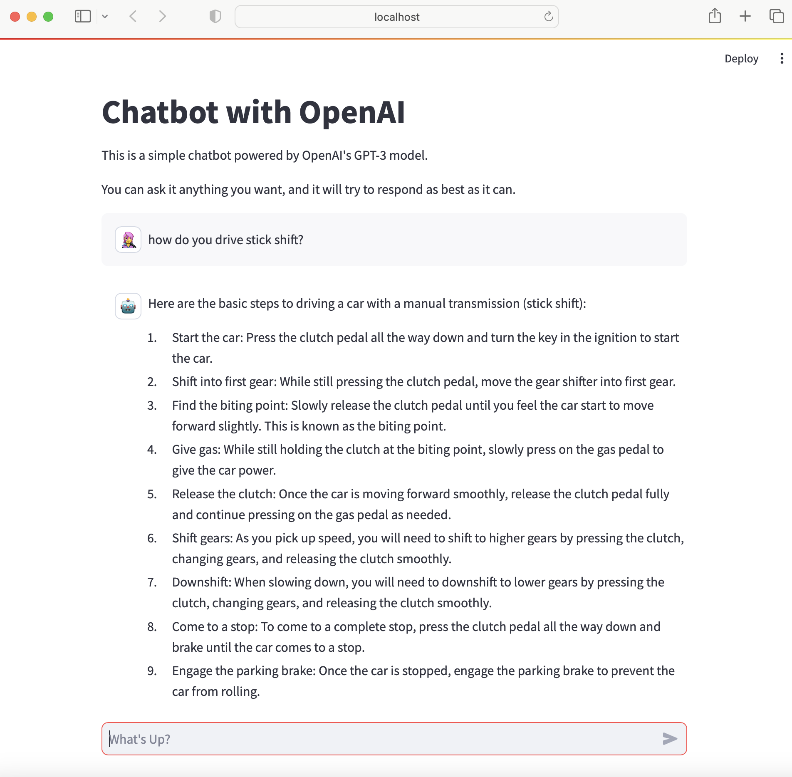

# Streamlit ChatBot with Open Source LLM

## Dependencies
* Streamlit
* OpenAI

## Open Source LLM
* I chose to use Open AI's GPT3.5 Turbo model as my open source LLM
* The chatbot instantiates the model, takes user input, then feeds that input into the model
* It, finally, prints the model response to the app

## Deployment
* I chose to use Streamlit to deploy my app
* My streamlit app is connected to this github repository
* To deploy, we need to add a secret key to the streamlit secrets

## Screenshots

### Web App on Local device

### Deployment Successful

### Deployed Web App

